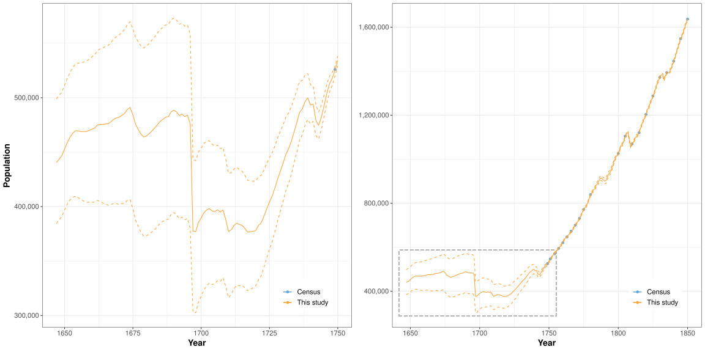

# Data and codes for *Bayesian reconstruction of historical population in Finland 1647-1850*

This repository contains data, model file and scripts for estimating the Finnish population in 1647-1850 as in paper Voutilainen, Helske, Högmander (2019), *Bayesian reconstruction of historical population in Finland 1647-1850*, to appear in Demography.

The final model is defined in file `population_model.stan` and the corresponding `R` script is in `population_model.R`. File `results.R` was used to store necessary data for figures, and it also contains codes for the summary statistics presented in the paper. The codes for drawing the figures are in file `bw_figures.R`. Note that the main output file `fit_population_model.R` from the modelling is not available at Github as the file size is over 80GB. However, the posterior samples of time-invariant hyperparameters are in file `theta.rds`, and the mean estiamtes as well as the limits of the 95% posterior interval are available in files `summary_*.rds` for mean process mu and correction coefficients lambda. Summary of time-invariant hyperparameters theta can be found from `summary_stats.txt`, and bigger versions of the paper figures can be found from files `Fig*_big.pdf`.

